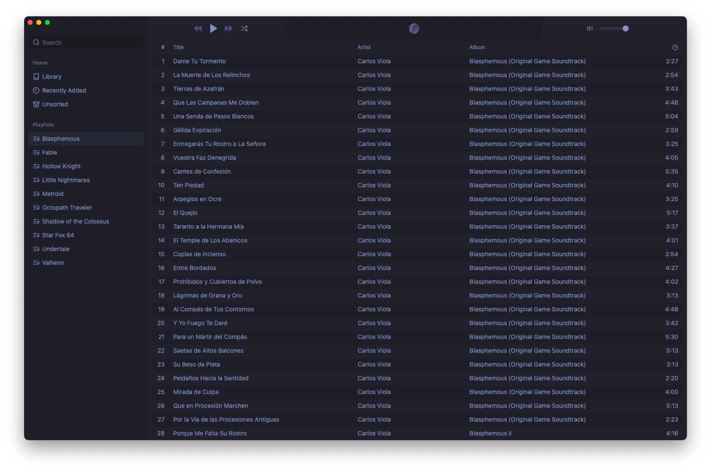
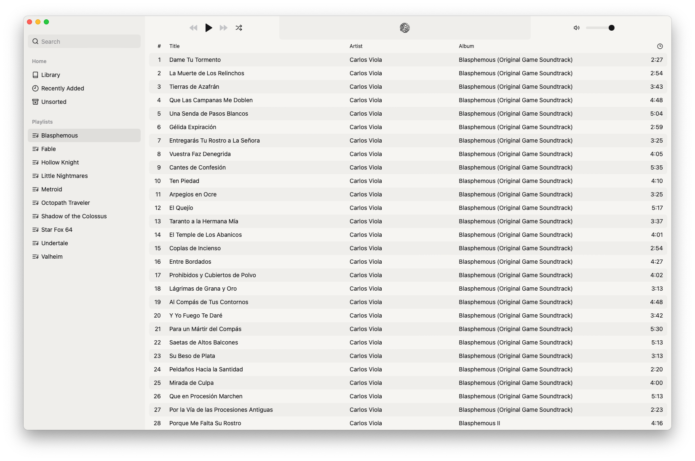

<div align="center">


🚧 **WIP** 🚧

<h1>MoonWave</h1>

**Music player for local files on MacOS**

</div>





## Installation

See [releases](https://github.com/MichaelOstermann/MoonWave/releases/latest).

## Building

Requirements:

- [Tauri](https://v2.tauri.app/start/prerequisites/#macos)
- [Bun](https://bun.sh/)

```sh
bun run install-ffmpeg
bun install --frozen-lockfile
bun run tauri build
```

Afterwards, the app can be found in `src-tauri/target/aarch64-apple-darwin/release/bundle/**`.
